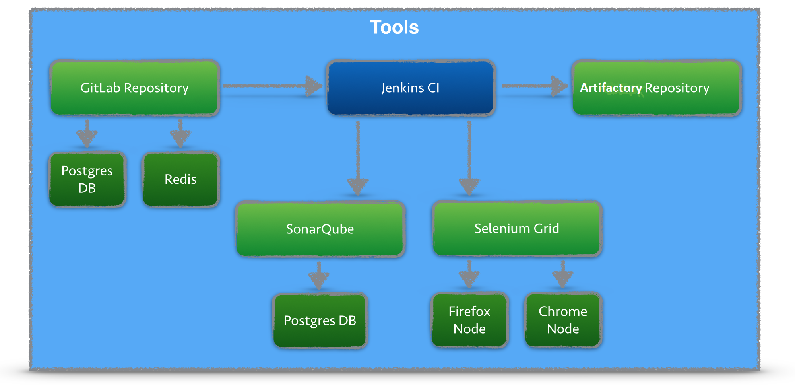
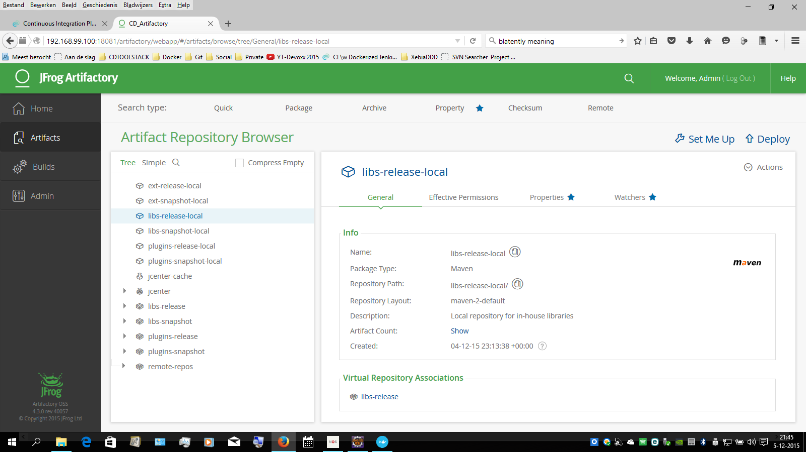

# CD Tools Demo

This GitHub repository contains Dockerfiles for running a set of Continuous Delivery Tools with a single command.
The diagram contains all tools used in the Docker containers.



The setup is blatantly copied from https://blog.codecentric.de/en/2015/10/continuous-integration-platform-using-docker-container-jenkins-sonarqube-nexus-gitlab  , so all credits go to Marcel Birkner.

## Prerequisites (Windows)

You should have Docker Toolbox installed, see https://www.docker.com/toolbox

I am using docker-compose to start several docker container at once.
Since all containers run in a single VM (virtualbox), this VM needs enough memory.

### Step 0 - List Docker Machine

```
~/github/cd-tool-stack$ docker-machine ls

NAME      ACTIVE   DRIVER       STATE     URL                         SWARM
default   *        virtualbox   Running   tcp://192.168.99.100:2376
```

### Step 1 - Stop your docker VM

```
docker-machine stop default
```

### Step 2 - Increase Memory via VirtualBox UI

I am using 6000MB for my VM.


### Step 3 - Start VM

```
docker-machine start default
```

## Getting started

Create the folder structure used to mount the data volumes of the images:

```
<USER_HOME> = c:\Users\<USER_NAME>
<DOCKER_VOLUMES> = <USER_HOME>\docker\data
<DOCKER_VOLUMES>\artifactory\data
<DOCKER_VOLUMES>\artifactory\logs
<DOCKER_VOLUMES>\artifactory\backup
<DOCKER_VOLUMES>\jenkins
<DOCKER_VOLUMES>\sonarqube\data
<DOCKER_VOLUMES>\sonarqube\logs
<DOCKER_VOLUMES>\sonarqube\extensions
```

To get all docker containers up and running use:

```
git clone git@github.com:amesken/cd-tool-stack.git
cd cd-tool-stack
docker-compose up -d
```

## Access Tools

| *Tool* | *Link* | *Credentials* |
| ------------- | ------------- | ------------- |
| Jenkins | http://${docker-machine ip default}:18080/ | no login required |
| SonarQube | http://${docker-machine ip default}:19000/ | admin/admin |
| Artifactory | http://${docker-machine ip default}:18081/artifactory | admin/password |
| GitLab | http://${docker-machine ip default}:10080/ | root/5iveL!fe |
| Selenium Grid | http://${docker-machine ip default}:4444/grid/console | no login required |

## Screenshots

Here is an overview of all tools:

- GitLab is used for storing the Sourcecode
- Jenkins contains build job and is triggered once projects in GitLab are updated
- As part of the CI build, Jenkins triggers a static code analysis and the results are stored in SonarQube
- The Maven build uses Artifactory as a Proxy Repository for all 3rd party libs. The build artefacts are deployed to the Artifactory Release Repository
- The Selenium Grid contains Docker containers running Chrome and Firefox and is used for UI tests

### Jenkins Jobs

There are several jobs preconfigured in Jenkins.
The Jobs cover the following tasks:

- Continuous Integration Build with Maven
- Unit Tests
- Static Source Analysis results are stored in SonarQube
- JaCoCo Test Coverage
- Deployment to Artifactory
- Jenkins Job DSL examples
- Selenium UI Test


### SonarQube Dashboard


### Artifactory Repository



### Selenium Grid


